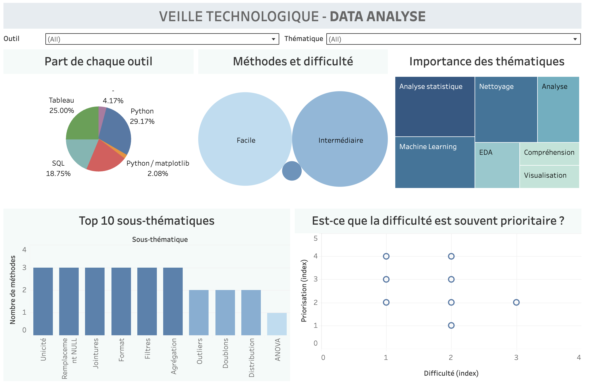
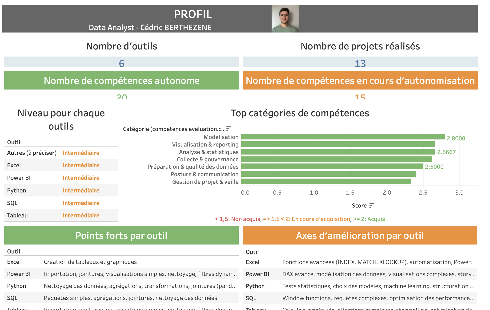
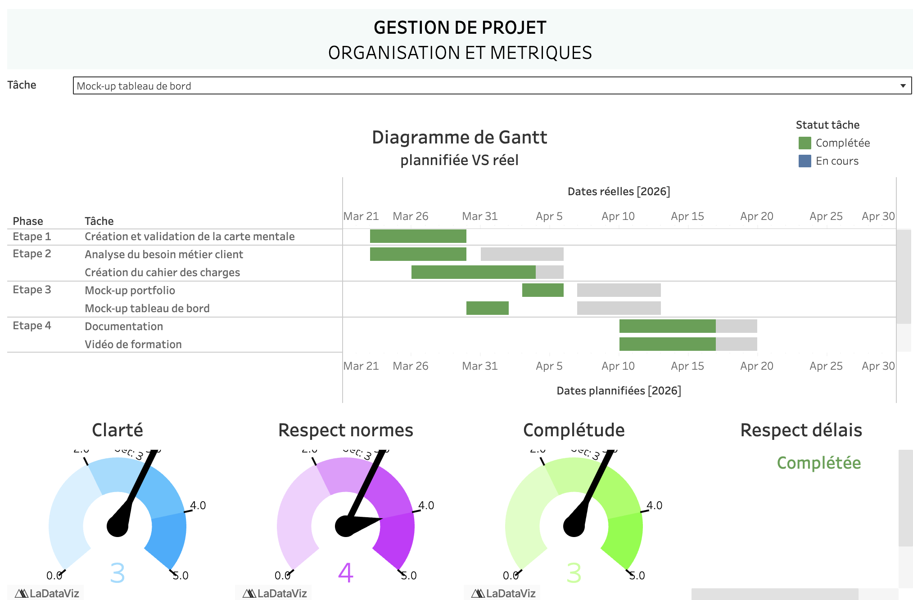
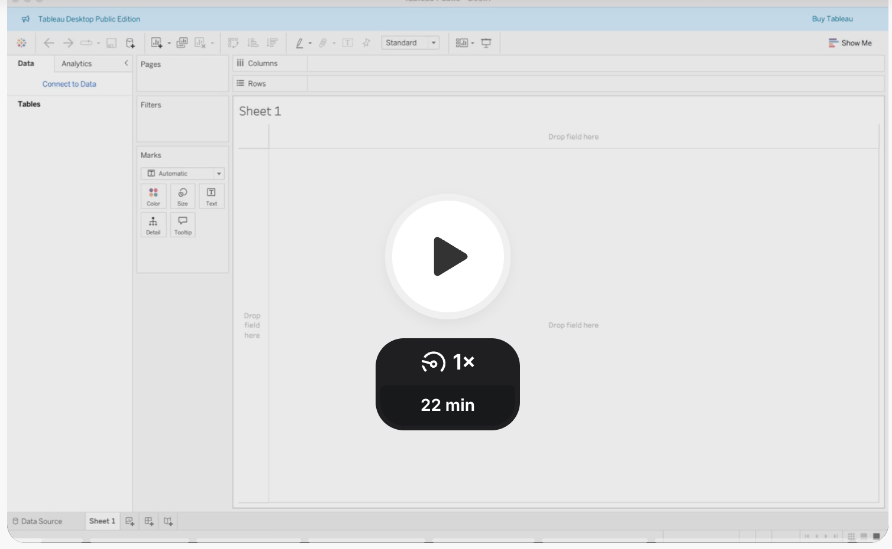

<HTML>
  <HEAD>
    <link rel="stylesheet" href="style.css" />
  </HEAD>
  <BODY>
  <h1> Cédric BERTHEZENE - Data analyst - Portfolio</h1>
  
  
  <nav>
    <ul>
      <li><b><a href="/portfolio_data_analysis">Accueil</a></b></li>
      <li><a href="/projet_principal.md">Projet Aéroworld</a></li>
      <li><a href="/autres_projets.md">Tous les projets</a></li>
    </ul>
  </nav>

  <h2>Projet principal</h2>
  
  
Démontrer mes compétences de chef de projet / expert data à travers une série de livrables (listés ci‑dessous) pour le compte du client Aeroworld.
  Pour accéder au détail de chaque livrable, cliquez sur son titre.

  

    <h3>A - Veille technologique</h3>
    
  

  
  ### [B - Profil](https://public.tableau.com/app/profile/cedric.berthezene/viz/profil_17767164585170/Profiletcomptences?publish=yes)
  
  
  ### [C - Rétroplanning](https://public.tableau.com/app/profile/cedric.berthezene/viz/gantt_tableau/Gestiondeprojets-mtriques?publish=yes)
  
  
  ### [D - Cahier des charges](/livrables/cahier_des_charges.pdf)
  
  ### [E - Analyse des besoins client](/livrables/analyse_besoins_metier.pdf)
  
  ### [F - Créer son tableau de bord sur Tableau - Vidéo de formation](https://www.loom.com/share/4541747106a84081adb09ad8c7630f1c)
  
  
  ### [G - Créer et partage ses graphiques sur Tableau - Documentation technique](/livrables/Creation_graphiques.pdf)
</BODY>
</HTML>
